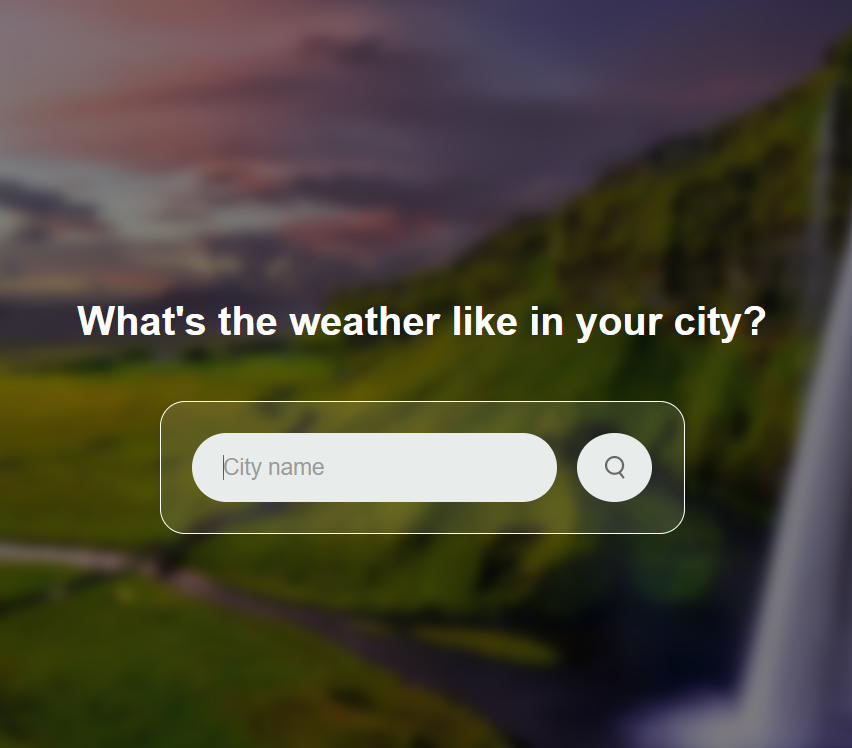

# 🌤️ Weather App

A sleek and interactive Weather App that provides current weather updates, temperature, wind speed, humidity, and a 3-day forecast for any city in the world. Built with modern web technologies, this app is user-friendly and visually appealing.

---

## 🚀 Features

- 🌍 **Real-Time Weather Data:** Get current temperature, weather conditions, wind speed, and humidity for any city.
- 🗓️ **3-Day Forecast:** View upcoming weather conditions for the next three days.
- 🌤️ **Dynamic Weather Icons:** Displays unique icons for weather types like clear skies, clouds, rain, snow, mist, and more.
- 🔍 **Search Functionality:** Quickly find weather data by entering the city name.
- ❌ **Error Handling:** Displays error messages when the city name is invalid or not found.

---

## 📸 Screenshots

### Home View


---

## 🛠️ Technologies Used

- **HTML5**: Semantic structure for the application.
- **CSS3**: Styled with responsive and clean design.
- **JavaScript (ES6)**: For app functionality and API integration.
- **OpenWeatherMap API**: Fetches real-time weather and forecast data.

## Check my code to get the API's for weather :sparkles:
---


## 🧩 How It Works
- Enter a city name in the search box and click the search button.
- The app fetches real-time data and displays:
- Current weather conditions.
- A 3-day weather forecast.
- Dynamic weather icons visually represent the current weather.


## Future Enhancements
- 🌌 Background Animations: Add dynamic backgrounds based on weather conditions.
- 📍 Geolocation Support: Auto-detect user's location for weather updates.

## ⚙️ Installation & Setup

1. Clone the repository:
   ```bash
   git clone https://github.com/Gur512/weather-app.git

